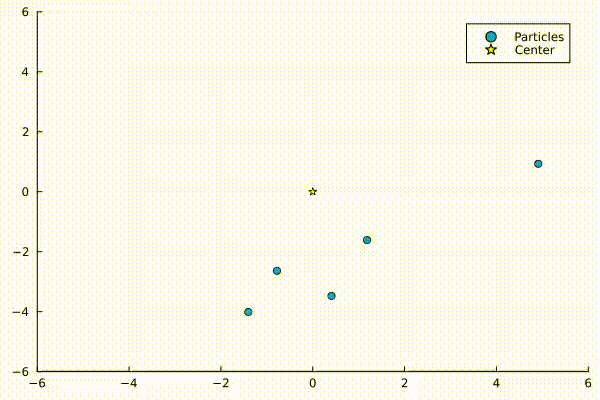

# Цель работы

Создать комплект программ. Выполнить описание программной реализации проекта

# Постановка задачи

Необходимо смоделировать движение (N) точек (частиц) в двумерной плоскости, которые:
 - Испытывают гравитационное притяжение к центральной неподвижной
 точке (например, “Солнцу”).
 - Не взаимодействуют между собой.
 - Движутся по круговым орбитам с первой космической скоростью.

# Теоретическое введение

Согласно теории Фридмана, Леметра, Гамова возникновение Вселенной произошло из точки в результате Большого взрыва примерно 13,7 млрд. лет назад. В этот момент времени, который берется за начало отсчета, Вселенная имела очень малый размер и экстремально высокие плотность и температуру. С тех пор Вселенная непрерывно расширяется и остывает. Самая ранняя эпоха, о которой существуют теоретические предположения, называется Планковской.
Она продолжалась порядка 10−43 секунды. В это время гравитационное взаимодействие отделилось от остальных фундаментальных взаимодействий (электрослабого и сильного). Вселенная представляла собой высоко однородную и изотропную среду плотностью 1093 г/см3 при температуре 1032 К. Через 10−35 секунды начался период так называемой Космической инфляции экспоненциального расширения Вселенной. 
После окончания этого периода (10−32 секунды) Вселенная представляла собой сгусток кварк-глюонной плазмы. Через 10−5 секунды Вселенная остыла настолько, что стало возможным объединение кварков и глюонов в протоны и нейтроны. Затем образовались элементарные частицы и простейшие ядра дейтерия и гелия. Примерно через 400 тысяч лет температура понизилась настолько, что стали возможными рекомбинация электронов с протонами и существование устойчивых атомов водорода. После этого материя стала прозрачной для излучения, часть которого дошла до нас в виде реликтового излучения.
Первоначально очень слабые нерегулярности в распределении и движении вещества Вселенной усиливались из-за гравитационной неустойчивости и привели к возникновению сильных неоднородностей — протоскоплений. Границами этих уплотнений служили ударные волны, на фронте которых первоначально безвихревое движение вещества приобретало завихренность. Распад уплотнений на отдельные сгущения происходил тоже, по-видимому, из-за гравитационной неустойчивости, и это дало начало протогалактикам.
Фрагментация протогалактических облаков в результате их гравитационной неустойчивости вела к возникновению первых галактик, в которых шло формирование звезд. Параллельно с этим процессом происходило формирование крупномасштабной структуры Вселенной — возникали сверхскопления галактик. Более крупных образований в Метагалактике — наблюдаемой области Вселенной — нет.
Образовавшиеся звезды эволюционировали. Наиболее массивные, масса которых превышала массу Солнца в несколько десятков раз, исчерпали свое водородное топливо за 3–8 миллионов лет и после этого превратились в сверхновые звезды, быстро проходя этап красного гиганта и сбрасывая оболочку мощным взрывом, в результате которого образовались ударные волны. Во время взрыва синтезировались тяжелые элементы. Ядро таких звезд быстро сжимается, и, если его масса не превышает двух масс Солнца, превращается в нейтронную звезду.
Звезды, сравнимые по массе с Солнцем, после выгорания водородного топлива за время порядка 10 миллиардов лет превращались в красные гиганты и постепенно сбрасывали свою оболочку. Потерявшее оболочку ядро становилось белым карликом, который постепенно остывал. Сброшенная оболочка становилась межзвездным газом и пылью.


# Математическая модель

**Пусть центральное тело имеет массу** $$ \( M \), $$
   гравитационную постоянную $$ \( G \) $$

**Для частицы на орбите радиуса \( r_i \) первая космическая скорость равна:**  
  $$ \( v_i = \sqrt{\frac{GM}{r_i}} \) $$

**Угловая скорость частицы:**  
  $$ \( \omega_i = \frac{v_i}{r_i} = \sqrt{\frac{GM}{r_i^3}} \) $$

**Начальный угол частицы на орбите:**  
  $$ \( \theta_{i,0} \) $$  

**Положение частицы в момент времени** $$ \( t \) $$
  **задаётся формулами:**

  $$ \
  x_i(t) = r_i \cos(\omega_i t + \theta_{i,0})
  \ $$

  $$ \
  y_i(t) = r_i \sin(\omega_i t + \theta_{i,0})
  \ $$

# Программная реализация на Julia (аналитический подход)

```julia
using Plots

function simulate_particles(N::Int, time_steps::Int, dt::Float64, central_mass::Float64)
    positions = zeros(Float64, N, 2)
    velocities = zeros(Float64, N, 2)

    for i in 1:N
        r = 10.0 * i
        v = sqrt(central_mass / r)
        positions[i, :] = [r, 0.0]
        velocities[i, :] = [0.0, v]
    end

    trajectory = zeros(Float64, time_steps, N, 2)

    for t in 1:time_steps
        for i in 1:N
            r = norm(positions[i, :])
            acceleration = -central_mass * positions[i, :] / r^3
            velocities[i, :] += acceleration * dt
            positions[i, :] += velocities[i, :] * dt
            trajectory[t, i, :] = positions[i, :]
        end
    end

    return trajectory
end

using Plots

function plot_trajectory(trajectory)
    time_steps, N, _ = size(trajectory)
    anim = []

    for t in 1:time_steps
        x = trajectory[t, :, 1]
        y = trajectory[t, :, 2]
        scatter(x, y, xlims=(-500, 500), ylims=(-500, 500), aspect_ratio=:equal, legend=false,
                title="Particle Orbits")
    end
    
    gif(anim, "particle_orbits.gif", fps=30)
end

N = 10
time_steps = 500
dt = 0.01
central_mass = 1000.0

trajectory = simulate_particles(N, time_steps, dt, central_mass)
plot_trajectory(trajectory)
```
## Предоставление видео-выполнения исследования

Ознакомиться с видео-выполнением можно здесь:

<iframe width="560" height="315" src="https://plvideo.ru/watch?v=Z-SYZNIzky3q" frameborder="0" allowfullscreen></iframe>

## Презентация выполнения исследования в рамках 3-его этапа выполнения

---
title: My page
type: landing

sections:
  - block: slider
    content:
      slides:
        - title: 👋 Welcome to the group
          content: Take a look at what we're working on...
          align: center
          background:
            image:
              # Specify an image from `assets/media/`
              # or delete the image section to remove it
              filename: coders.jpg
              filters:
                brightness: 0.7
            position: right
            color: '#666'
        - title: Lunch & Learn ☕️
          content: 'Share your knowledge with the group and explore exciting new topics together!'
          align: left
          background:
            image:
              # Specify an image from `assets/media/`
              # or delete the image section to remove it
              filename: contact.jpg
              filters:
                brightness: 0.7
            position: center
            color: '#555'
        - title: World-Class Semiconductor Lab
          content: 'Just opened last month!'
          align: right
          background:
            image:
              # Specify an image from `assets/media/`
              # or delete the image section to remove it
              filename: welcome.jpg
              filters:
                brightness: 0.5
            position: center
            color: '#333'
          link:
            icon: graduation-cap
            icon_pack: fas
            text: Join Us
            url: ../contact/
    design:
      # Slide height is automatic unless you force a specific height (e.g. '400px')
      slide_height: ''
      # Make the slides full screen within the browser window?
      is_fullscreen: true
      # Automatically transition through slides?
      loop: false
      # Duration of transition between slides (in ms)
      interval: 2000
---


## Выполнение кода

В итоге получился gif движения планетной системы:

<figure>
    
    <figcaption>Планетная система</figcaption>
</figure>

## Итоги исследования

- В первом (аналитическом) подходе частицы движутся по идеально круговым орбитам с постоянной угловой скоростью, вычисленной по формуле первой космической скорости.

- Во втором (численном) подходе решается система дифференциальных уравнений второго порядка, описывающая движение частиц под действием центральной силы притяжения, что позволяет учитывать более общие случаи и получать траектории численным интегрированием.

- Оба подхода реализуются на языке Julia с использованием пакетов Plots и DifferentialEquations.

- Визуализация осуществляется с помощью анимации движения частиц вокруг центральной точки.
